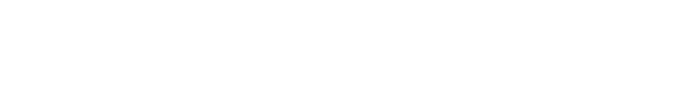

# Monad Native Day 1 Toolkit

Build your personalized Monad Mainnet Day 1 Toolkit. Select your favorite DeFi protocols, wallets, and tools to prepare for Monad's launch.

## ✨ Features

- **11 Categories**: Choose from DeFi, DEX, Lending, Stablecoins, Bridges, Wallets, NFT Marketplaces, Oracles, Gaming, Social, and Launchpads
- **Smart Selection Limits**: Dynamic maximum selections based on available options in each category
- **Beautiful Canvas Export**: Generate a shareable image of your toolkit with custom branding
- **Twitter Integration**: Share your toolkit directly on Twitter/X with one click
- **Responsive Design**: Optimized experience for both desktop and mobile devices
- **Progress Tracking**: Visual indicators show your completion status
- **Click to Copy**: Desktop users can click the result card to copy the image to clipboard
- **Custom Username**: Add your Twitter handle to personalize your toolkit

## 🎯 How It Works

### Desktop Experience

1. Browse through 11 protocol categories displayed in an expandable accordion
2. Select your preferred protocols (limits vary by category)
3. Watch your toolkit build in the sidebar
4. Add your Twitter username (optional)
5. Click the card to copy the image or use the Share button

### Mobile Experience

1. Step through each category one at a time
2. Select protocols with easy-to-tap vertical buttons
3. Review your complete toolkit on the final screen
4. Add your Twitter username (optional)
5. Generate and share your toolkit image

## 🛠️ Tech Stack

- **HTML5** - Semantic markup
- **CSS3** - Custom styles with Tailwind CDN
- **JavaScript** - Vanilla ES6+
- **html2canvas** - Canvas image generation
- **Google Fonts** - Cinzel, Cinzel Decorative, Quicksand

## 📦 Project Structure

```
neverland-monadtoolkit/
├── index.html                       # Main HTML file
├── css/
│   └── styles.css                   # Custom styles (Tailwind)
├── js/
│   └── app.js                       # Main application logic
├── img/
│   ├── brands/                      # Protocol logos (56 WebP images)
│   ├── neverland_full.png
│   ├── neverland_logomark.png
│   └── og-banner.webp
├── favicon.ico
├── icon0.svg
├── icon1.png
├── apple-icon.png
├── web-app-manifest-192x192.png
├── web-app-manifest-512x512.png
└── manifest.json                     # PWA manifest
```

## 🚀 Getting Started

### Local Development

1. Clone the repository:

```bash
git clone https://github.com/nafyn/neverland-monadtoolkit.git
cd neverland-monadtoolkit
```

2. Open `index.html` in your browser:

```bash
# Using Python
python -m http.server 8000

# Using Node.js
npx serve

# Or simply open the file
open index.html
```

3. Navigate to `http://localhost:8000` (if using a local server)

### Deployment

The project is deployed on Vercel.

```
https://toolkit.neverland.money/
```

## 🎨 Design Features

### Color Palette

- **Primary Purple**: `#D767FF`
- **Dark Purple**: `#C757D8` to `#9A00B2`
- **Background**: Linear gradient from `#200041` to `#2E0958`

### Typography

- **Headings**: Cinzel, Cinzel Decorative
- **Body**: Quicksand

### Responsive Breakpoints

- **Mobile**: < 768px
- **Desktop**: ≥ 768px

## 📱 Progressive Web App

The toolkit is installable as a PWA with:

- Offline support
- App-like experience
- Custom splash screen
- Multiple icon sizes

## 🔧 Configuration

### Selection Limits

- Categories with 2 options: Max 1 selection
- Categories with 3 options: Max 2 selections
- Categories with 4+ options: Max 3 selections

### Canvas Specifications

- **Dimensions**: 1000px × 1200px
- **Format**: PNG
- **Filename**: `my-monad-toolkit.png`

## 📄 License

This project is open source and available under the MIT License.

## 🙏 Credits

- **Created by**: [@pince_croco](https://x.com/pince_croco)
- **Powered by**: [Neverland](https://x.com/Neverland_Money)
- **Built for**: The Monad community

## 🔗 Links

- **Live Site**: [https://toolkit.neverland.money](https://toolkit.neverland.money)
- **GitHub**: [https://github.com/nafyn/neverland-monadtoolkit](https://github.com/nafyn/neverland-monadtoolkit)
- **Neverland**: [https://neverland.money](https://neverland.money)
- **Monad**: [https://monad.xyz](https://monad.xyz)

---

Made with 🤍 for the Monad ecosystem
